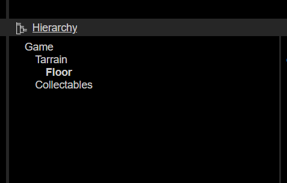
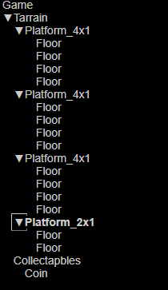
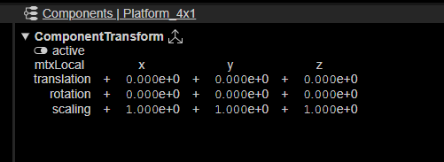
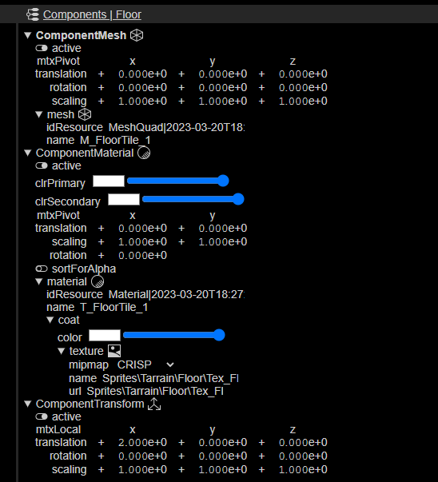
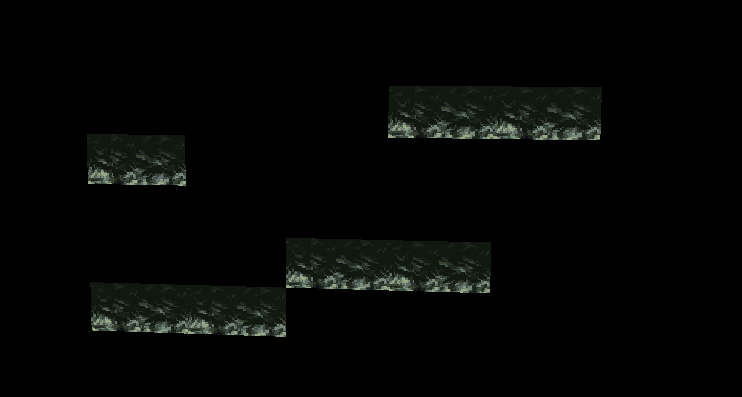
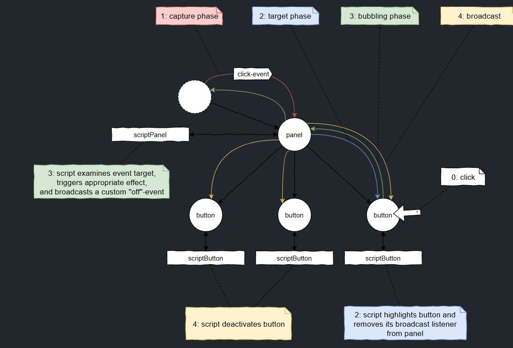

# Fudge Basics

## Coordinates in Fudge

20.03.23

### Point 2

* Hirachi Nodes
  * Geometrical
  * Logical

### Point 1

* Fudge is using a right hand coordinates system
* z-Achsis is forword!
* Camera looks in the z-Achses is forword

### Culling

* culling -> front and back side
  * you can see if the z-Achses is pointg to wards the camera
  * there is a two sideded Quad
  * Important!

### External resources

* **dose not work in the current version!**
* External resources -> to internal -> than it will become an textureImage

### Transforming GameObjects

* Moving the Mesh on the TransformMatrix will cause problem
  * Node is on the origin, mesh is somwhere else.
* Use a Transform Component to move the Mesh!

> * [X] **TASK: Create a Level for FUDGE!**
>
> ---

Fudge Level:

# 23.03.23 :date:

* Z-Fighting => Z-BufferError Means that two faces/meshes overlaping each other on the same plane and the Tile Texture flickers.

## The Camera

* The camerer has an FOV/Opening angle. Problem, in which angle is the Fov? Diagonal/Horizontal/Vertical :Standard is the **diagonal Angle**
* Usualy you have a far Plane for the for the distacne and a Plane for the near distance.
  * Performence boost :Rendering onliy inside the Piramide. Between Far and Near plane.
* -> Render to a cube! Squiching the far end of the Plane and streching the near Plane.
  * FievSpace!
* Deph buffer and Z buffer is the same
  * 16 bit -> 65Thousend slices! Not that precission.
  * The Z-Buffer resuolution is not linier its is more dense near the Camera.

### Nodes

* What are Nodes?
  * Pivot Point -> Rotate on the spot!
  * MTX stands for Matrix

# Fudge Disable AutoCam

* anotate types with javascript
  * autoview.js
* eventListener ("load", init) calls the init function
* Fudge has an Build in Events system.
  * Fudge implements the invent trough the Graph (Node can send masseges to other Nodes)
* User interaction needs to start the audio.
  * That is why the weclom massegs is there.
  * zeile 28
* Fusge.Project -> all resaursces are in that.
* Camera is a component
* 49->52 are the think we need
* fAid has advance function for Autoview (e.g MauspointerLook)
* the audio manager is also there
* dispach event -> get rid of event

Task: Remove the Camera and Audio

* You can drop stuff from the Component window to Rendered Game window.
* looking to the Backside. You need to rotate the Camera around 180° again! and than move +Z
* Dont to mtxWorld! This will not be used! Use the mtxPivot
* Rotation is in degreess nor Rad.

# Fudge Event System

[Eventsystem · JirkaDellOro/FUDGE Wiki (github.com)](https://github.com/JirkaDellOro/FUDGE/wiki/Eventsystem)

* Wich object is the last Event object?
* Iv nobody handels the element, the Event will bubble to the Parent Capture the event on the Documet!! maybe xD BRUTE FORCE

## Implementation of Gravity

* adding velocyte to my veloity
  * on the ground every frame the velocity is 0
  * Jumping add Velocity upword!
* Make someting fall! Velocity
* Get postion than check and et least make the change!

# Next Prima 30.03.2023

## Transfromation Matrix in Games

* 2D Transform Matrix

  * |1 0|
  * |0 1| <- Identity matrix / no change
  *
  * |1 1|
  * |0 1| x' = x+y, y'= y
* 3D Transform Matrix

  * |
  * |
  * |
* RealTime is the system time
* GameTime is the game time, can be set diffrently  like slow motion

  * Both are in Miliseconds to adjust it to one second just devide it by 1000

## Collisions!!

* Collisions are allways on the world coordinates
* Collision detection with boundingboxes
  * Simplest = Boundning circle -> checking = (r1+r2)
    * Collision when the distance of the origin of both of the object are smaller
    * Sqr is a difficutl calculation on the PC
    * (p1- p2 < (r1+r2)^2 <- is a form of "culling" easy to check if objects are in reache
* Better Collision bounds for the pc is ->
  * Character know the mtxWorld
  * Tile know his mtxWolrdInverse <-- (makes it backwardss)
    * Calculate mtxWorld to the Tile.mtxWorldInverse()
    * Then check inside if the player is inside the bounderys of 0.5 ....
* Best look up video to inverse Matrix:[Inverse Matrizen, Lösungsraum und Nullraum | Essenz der Linearen Algebra, Kapitel 6 - YouTube](https://www.youtube.com/watch?v=uQhTuRlWMxw&list=PLZHQObOWTQDPD3MizzM2xVFitgF8hE_ab&index=7)

TASK make the Collision!!!

# LoopModes

f.Loop.start() <-- LOOP_MODE -> man kann vom Loop auskoppeln und etwas anderes einstellen

* zb. Time Frame .set ...
* Matrix * Vector(Position)
