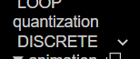
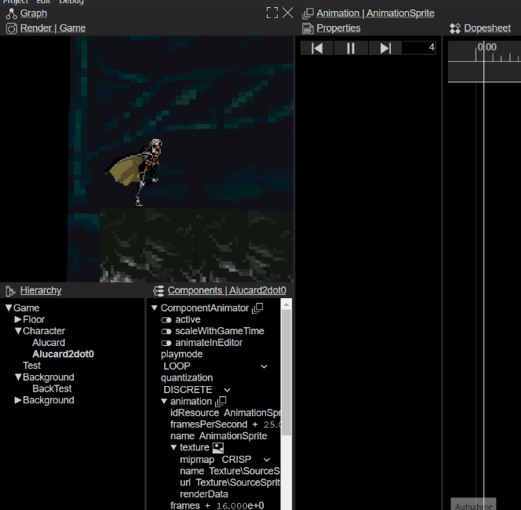
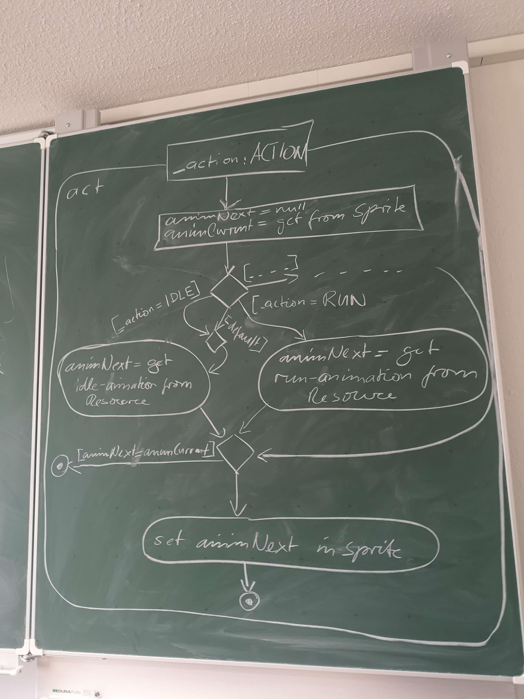
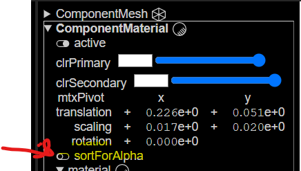

# Fudge Basics

## Coordinates in Fudge

20.03.23

### Point 2

* Hirachi Nodes
  * Geometrical
  * Logical


### Point 1

* Fudge is using a right hand coordinates system
* z-Achsis is forword!
* Camera looks in the z-Achses is forword

### Culling

* culling -> front and back side
  * you can see if the z-Achses is pointg to wards the camera
  * there is a two sideded Quad
  * Important!

### External resources

* **dose not work in the current version!**
* External resources -> to internal -> than it will become an textureImage

### Transforming GameObjects

* Moving the Mesh on the TransformMatrix will cause problem
  * Node is on the origin, mesh is somwhere else.
* Use a Transform Component to move the Mesh!

> * [X] **TASK: Create a Level for FUDGE!**
>
> ---

Fudge Level:


# 23.03.23 :date:

* Z-Fighting => Z-BufferError Means that two faces/meshes overlaping each other on the same plane and the Tile Texture flickers.

## The Camera

* The camerer has an FOV/Opening angle. Problem, in which angle is the Fov? Diagonal/Horizontal/Vertical :Standard is the **diagonal Angle**
* Usualy you have a far Plane for the for the distacne and a Plane for the near distance.
  * Performence boost :Rendering onliy inside the Piramide. Between Far and Near plane.
* -> Render to a cube! Squiching the far end of the Plane and streching the near Plane.
  * FievSpace!
* Deph buffer and Z buffer is the same
  * 16 bit -> 65Thousend slices! Not that precission.
  * The Z-Buffer resuolution is not linier its is more dense near the Camera.

### Nodes

* What are Nodes?
  * Pivot Point -> Rotate on the spot!
  * MTX stands for Matrix

# Fudge Disable AutoCam

* anotate types with javascript
  * autoview.js
* eventListener ("load", init) calls the init function
* Fudge has an Build in Events system.
  * Fudge implements the invent trough the Graph (Node can send masseges to other Nodes)
* User interaction needs to start the audio.
  * That is why the weclom massegs is there.
  * zeile 28
* Fusge.Project -> all resaursces are in that.
* Camera is a component
* 49->52 are the think we need
* fAid has advance function for Autoview (e.g MauspointerLook)
* the audio manager is also there
* dispach event -> get rid of event

Task: Remove the Camera and Audio

* You can drop stuff from the Component window to Rendered Game window.
* looking to the Backside. You need to rotate the Camera around 180° again! and than move +Z
* Dont to mtxWorld! This will not be used! Use the mtxPivot
* Rotation is in degreess nor Rad.

# Fudge Event System

[Eventsystem · JirkaDellOro/FUDGE Wiki (github.com)](https://github.com/JirkaDellOro/FUDGE/wiki/Eventsystem)


* Wich object is the last Event object?
* Iv nobody handels the element, the Event will bubble to the Parent Capture the event on the Documet!! maybe xD BRUTE FORCE

## Implementation of Gravity

* adding velocyte to my veloity
  * on the ground every frame the velocity is 0
  * Jumping add Velocity upword!
* Make someting fall! Velocity
* Get postion than check and et least make the change!

# Next Prima 30.03.2023

## Transfromation Matrix in Games

* 2D Transform Matrix

  * |1 0|
  * |0 1| <- Identity matrix / no change
  *
  * |1 1|
  * |0 1| x' = x+y, y'= y
* 3D Transform Matrix

  * |
  * |
  * |
* RealTime is the system time
* GameTime is the game time, can be set diffrently  like slow motion

  * Both are in Miliseconds to adjust it to one second just devide it by 1000

## Collisions!!

* Collisions are allways on the world coordinates
* Collision detection with boundingboxes
  * Simplest = Boundning circle -> checking = (r1+r2)
    * Collision when the distance of the origin of both of the object are smaller
    * Sqr is a difficutl calculation on the PC
    * (p1- p2 < (r1+r2)^2 <- is a form of "culling" easy to check if objects are in reache
* Better Collision bounds for the pc is ->
  * Character know the mtxWorld
  * Tile know his mtxWolrdInverse <-- (makes it backwardss)
    * Calculate mtxWorld to the Tile.mtxWorldInverse()
    * Then check inside if the player is inside the bounderys of 0.5 ....
* Best look up video to inverse Matrix:[Inverse Matrizen, Lösungsraum und Nullraum | Essenz der Linearen Algebra, Kapitel 6 - YouTube](https://www.youtube.com/watch?v=uQhTuRlWMxw&list=PLZHQObOWTQDPD3MizzM2xVFitgF8hE_ab&index=7)

TASK make the Collision!!!

# LoopModes 📅 03.04.2023

f.Loop.start() <-- LOOP_MODE -> man kann vom Loop auskoppeln und etwas anderes einstellen

* zb. Time Frame .set ...
* Matrix * Vector(Position) (let v3:f.vector3 = f.Vector3.TRANSFORMATION(Vector3, Matrix,Ausrichtung!-> True))
* Code im github von Jirka
* Steigung von eine Tile
  * mtxLocal.getX.geo (das sind cardinalachsen) geo gibt dir den winkel raus
  * mtxLocal.rotation = f.Vector3; setzt den winkel
  * f.Vector3.Y() erstell einen Vector Richtung Y, kann man auch so nutzen f.Vector3.Y(50) [50° dreheung bei y]
* Im editor kann man F2 drücken damit man werte direkt ändern kann!

### **Aufgabe?!**

* Sprite animation!!
* Fudge hat eine Animationsystem

[20230403_171451_image.png](assets/20230403_171451_image.png)

Leider ist im Fudge ein Problem mit diesen AnimationsFrame auswhal

* mehr zu animaitonnen:
* 
* 
* 
* Das animations sprite nimmt sich die Kontrolle vom Material

#* Animations Ediotor läuft leider auch noch nicht

# Problems and so one 📅06.04.2023

* If you need to change a lot of things. Do that in the internal.json. There will be the node Tree, where you can change the Nodes and there components.
* You can get the scaling of objects and so with: let mtexNewLocal = node.mtxLocal.scaling<--
* add issue (AnimSprite prevwiee wont update when you put a texture inside)
* #
* **TAKS::** Change the animation for "sonic"

You can get Recourses by FudgeCore.getResurcesByName???

ActionSequence-> AktivityDiagram 

# Fudge :date: 20.04.2023

Using Audio like that

```typescript
   ƒ.AudioManager.default.listenWith(graph.getComponent(ƒ.ComponentAudioListener));
    ƒ.AudioManager.default.listenTo(graph);
```

Update audio at last point in the Audio UpdateFunction

```typescript
   viewport.draw();
    ƒ.AudioManager.default.update();
  }
```

The graph for the audio manager

```typescript
  let graph: ƒ.Graph = <ƒ.Graph>viewport.getBranch();
```

Be aware that the code snippets are not sorted!

## For animations

Look into Avel code He did something amazing wiht changing materails for animation:

```typescript
 /**
         * right or left
         * @param {string} side
         */
        setSide(side: string) {
            let newRotation = this.node.mtxLocal.rotation;
            newRotation.y = side === 'right' ? 0 : 180;
            this.node.mtxLocal.rotation = newRotation;
        }

        move() {
            this.speedX += timeBased(this.accX);
            this.speedY += timeBased(this.accY);

            // If the speed is negativ, sonic is going to the left so we change his side
            if (this.speedX < 0) {
                this.setSide('left');
            } else if (this.speedX > 0) {
                this.setSide('right');
            }

            // abs because the side is changed for the node
            this.node.mtxLocal.translateX(timeBased(Math.abs(this.speedX)));
            this.node.mtxLocal.translateY(timeBased(this.speedY));

            // So sonic don't go under 1 in y
            // let posY = this.getY()
            // if (posY < 1) {
            //     this.setY(1);
            //     this.isJumping = false;
            //     this.speedY = 0;
            // }
        }

        anim() {
            const currentAnimation = this.visual.getComponent(ƒ.ComponentAnimator)
            let nextAnimationName = null
            if (this.isJumping) {
                nextAnimationName = 'SonicJump'
            } else if (this.speedX !== 0) {
                nextAnimationName = 'SonicRun'
            } else {
                nextAnimationName = 'SonicIdle'
            }

            if (currentAnimation.animation.name !== nextAnimationName) {
                const nextAnimation = ƒ.Project.getResourcesByName(nextAnimationName)[0] as ƒ.AnimationSprite
                currentAnimation.animation = nextAnimation
            }
        }
```

quelle: [GitHub](https://github.com/easzyyyyy/prima/https:/) and [Sprite.TS](https://github.com/easzyyyyy/prima/blob/main/Projects/Sonic/Script/Source/Sprite.ts)

Also he did the sound

````typescript
jump() {
            if (!this.isJumping) {
                this.speedY = 10;
                this.isJumping = true;
                this.playSound('jump.mp3');
            }
````

Taks: Adding sound to the Project. Jump and background sound.

More tips to Animation and Sound:


## Zbuffer sorting

Problem we have a windwo infront of sonic. The window is half Transparent How can we fix that?

* If we overlap twoe half transparent objects, nobody will win the fight if they have the same Z hight.
* Also if we have a window, we cannot see trough that window and see tha backgground.
* Fix: We tacke all objects who needs sorting. So everyting what is transparet will rendered after everything is rendered.

Set up in the Editor:



--


### Fixing position

pos' = T2^-1 * pos

correct pos' to upper edge -> pos'' T2 * pos'

in code:

```typescript
//node is the origin point of Sonic / Alucard
pos = f.Vector3.TRANSFORMATION(pos, node.mtxWorld, true);
```

# Create -> MINEACRAFT"!!!

Basic stuff to understand

* Flat shader means:  The flat shader just uses the Normals too look up how "light" the face will be.
  * The angle and the face normal shows the birgtness of the face if the light hits 180° agains the face it is the lightest. if the vectors align perfecty, there is no light.
* Gourod shading
  * [Gouraud shading - Wikipedia](https://en.wikipedia.org/wiki/Gouraud_shading)
  * 
  * 
  * 
* The Phong shader
  * [Phong shading - Wikipedia](https://en.wikipedia.org/wiki/Phong_shading)
  * 

Thats are the task:

* [ ] Generate a world A perfect CUBE! world!
* [ ] Save Obects "CUBE" as a graph
  * [ ] Add node as a Father then add a transform to the father
  * [ ] Use the Grap as an instance to do a lot of diffrent cubes!
* [ ] Make Minecraft a real Fudge thing!
* [ ] You can create more cubes in Runtime or you can create instances in the editor.
  * [ ] -> Resources create instances -> Add child adjust property...
  * [ ] Best to add a node bevor the instance to add Transform
