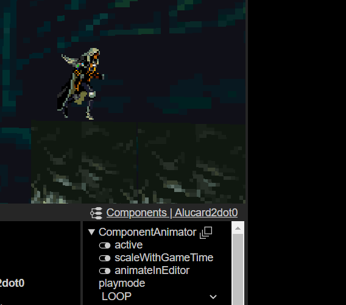
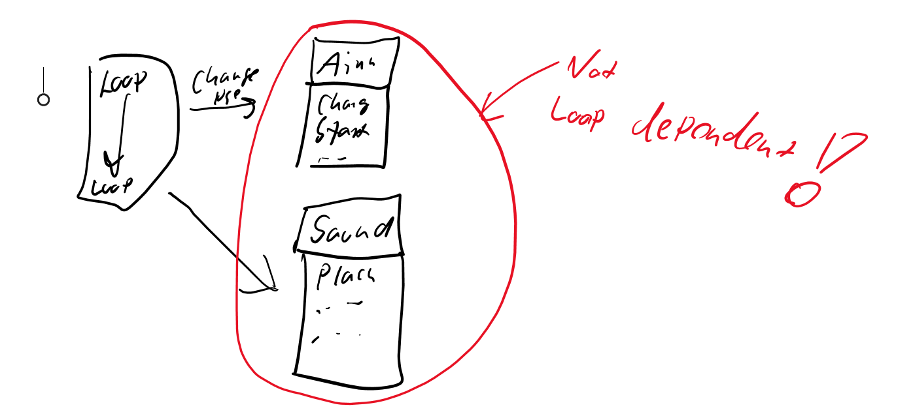
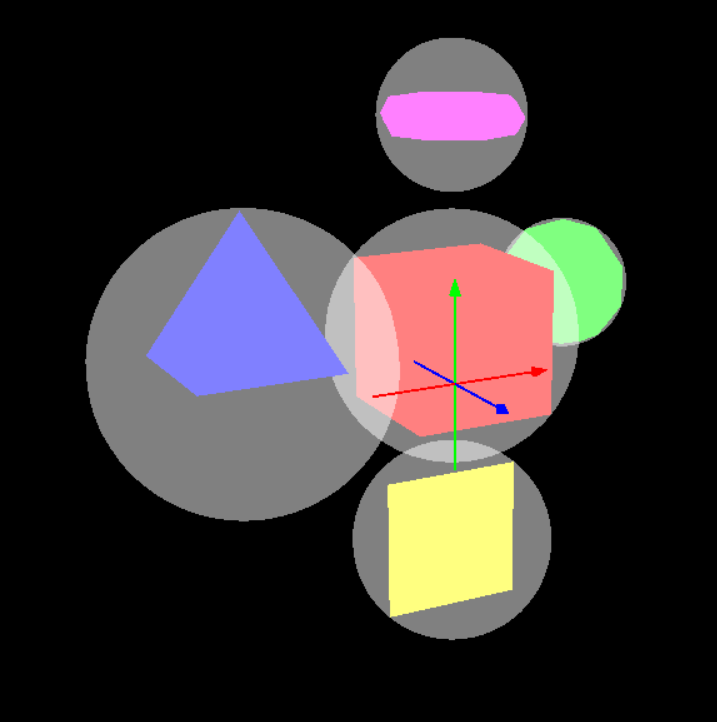

# Fudge Basics

## Coordinates in Fudge

### Point 2

* Hirachi Nodes
  * Geometrical
  * Logical


### Point 1

* Fudge is using a right hand coordinates system
* z-Achsis is forword!
* Camera looks in the z-Achses is forword

### Culling

* culling -> front and back side
  * you can see if the z-Achses is pointg to wards the camera
  * there is a two sideded Quad
  * Important!

### External resources

* **dose not work in the current version!**
* External resources -> to internal -> than it will become an textureImage

### Transforming GameObjects

* Moving the Mesh on the TransformMatrix will cause problem
  * Node is on the origin, mesh is somwhere else.
* Use a Transform Component to move the Mesh!

> * [X] **TASK: Create a Level for FUDGE!**
>
> ---

Fudge Level:


# 23.03.23 :date:

* Z-Fighting => Z-BufferError Means that two faces/meshes overlaping each other on the same plane and the Tile Texture flickers.

## The Camera

* The camerer has an FOV/Opening angle. Problem, in which angle is the Fov? Diagonal/Horizontal/Vertical :Standard is the **diagonal Angle**
* Usualy you have a far Plane for the for the distacne and a Plane for the near distance.
  * Performence boost :Rendering onliy inside the Piramide. Between Far and Near plane.
* -> Render to a cube! Squiching the far end of the Plane and streching the near Plane.
  * FievSpace!
* Deph buffer and Z buffer is the same
  * 16 bit -> 65Thousend slices! Not that precission.
  * The Z-Buffer resuolution is not linier its is more dense near the Camera.

### Nodes

* What are Nodes?
  * Pivot Point -> Rotate on the spot!
  * MTX stands for Matrix

# Fudge Disable AutoCam

* anotate types with javascript
  * autoview.js
* eventListener ("load", init) calls the init function
* Fudge has an Build in Events system.
  * Fudge implements the invent trough the Graph (Node can send masseges to other Nodes)
* User interaction needs to start the audio.
  * That is why the weclom massegs is there.
  * zeile 28
* Fusge.Project -> all resaursces are in that.
* Camera is a component
* 49->52 are the think we need
* fAid has advance function for Autoview (e.g MauspointerLook)
* the audio manager is also there
* dispach event -> get rid of event

Task: Remove the Camera and Audio

* You can drop stuff from the Component window to Rendered Game window.
* looking to the Backside. You need to rotate the Camera around 180° again! and than move +Z
* Dont to mtxWorld! This will not be used! Use the mtxPivot
* Rotation is in degreess nor Rad.

# Fudge Event System

[Eventsystem · JirkaDellOro/FUDGE Wiki (github.com)](https://github.com/JirkaDellOro/FUDGE/wiki/Eventsystem)


* Wich object is the last Event object?
* Iv nobody handels the element, the Event will bubble to the Parent Capture the event on the Documet!! maybe xD BRUTE FORCE

## Implementation of Gravity

* adding velocyte to my veloity
  * on the ground every frame the velocity is 0
  * Jumping add Velocity upword!
* Make someting fall! Velocity
* Get postion than check and et least make the change!

# Next Prima 30.03.2023

## Transfromation Matrix in Games

* 2D Transform Matrix

  * |1 0|
  * |0 1| <- Identity matrix / no change
  *
  * |1 1|
  * |0 1| x' = x+y, y'= y
* 3D Transform Matrix

  * |
  * |
  * |
* RealTime is the system time
* GameTime is the game time, can be set diffrently  like slow motion

  * Both are in Miliseconds to adjust it to one second just devide it by 1000

## Collisions!!

* Collisions are allways on the world coordinates
* Collision detection with boundingboxes
  * Simplest = Boundning circle -> checking = (r1+r2)
    * Collision when the distance of the origin of both of the object are smaller
    * Sqr is a difficutl calculation on the PC
    * (p1- p2 < (r1+r2)^2 <- is a form of "culling" easy to check if objects are in reache
* Better Collision bounds for the pc is ->
  * Character know the mtxWorld
  * Tile know his mtxWolrdInverse <-- (makes it backwardss)
    * Calculate mtxWorld to the Tile.mtxWorldInverse()
    * Then check inside if the player is inside the bounderys of 0.5 ....
* Best look up video to inverse Matrix:[Inverse Matrizen, Lösungsraum und Nullraum | Essenz der Linearen Algebra, Kapitel 6 - YouTube](https://www.youtube.com/watch?v=uQhTuRlWMxw&list=PLZHQObOWTQDPD3MizzM2xVFitgF8hE_ab&index=7)

TASK make the Collision!!!

# LoopModes 📅 03.04.2023

f.Loop.start() <-- LOOP_MODE -> man kann vom Loop auskoppeln und etwas anderes einstellen

* zb. Time Frame .set ...
* Matrix * Vector(Position) (let v3:f.vector3 = f.Vector3.TRANSFORMATION(Vector3, Matrix,Ausrichtung!-> True))
* Code im github von Jirka
* Steigung von eine Tile
  * mtxLocal.getX.geo (das sind cardinalachsen) geo gibt dir den winkel raus
  * mtxLocal.rotation = f.Vector3; setzt den winkel
  * f.Vector3.Y() erstell einen Vector Richtung Y, kann man auch so nutzen f.Vector3.Y(50) [50° dreheung bei y]
* Im editor kann man F2 drücken damit man werte direkt ändern kann!

### **Aufgabe?!**

* Sprite animation!!
* Fudge hat eine Animationsystem

[20230403_171451_image.png](assets/20230403_171451_image.png)

Leider ist im Fudge ein Problem mit diesen AnimationsFrame auswhal

* mehr zu animaitonnen:
* 
* 
* 
* Das animations sprite nimmt sich die Kontrolle vom Material

#* Animations Ediotor läuft leider auch noch nicht

# Problems and so one 📅06.04.2023

* If you need to change a lot of things. Do that in the internal.json. There will be the node Tree, where you can change the Nodes and there components.
* You can get the scaling of objects and so with: let mtexNewLocal = node.mtxLocal.scaling<--
* add issue (AnimSprite prevwiee wont update when you put a texture inside)
* #
* **TAKS::** Change the animation for "sonic"

You can get Recourses by FudgeCore.getResurcesByName???

ActionSequence-> AktivityDiagram 

# Fudge :date: 20.04.2023

Using Audio like that

```typescript
   ƒ.AudioManager.default.listenWith(graph.getComponent(ƒ.ComponentAudioListener));
    ƒ.AudioManager.default.listenTo(graph);
```

Update audio at last point in the Audio UpdateFunction

```typescript
   viewport.draw();
    ƒ.AudioManager.default.update();
  }
```

The graph for the audio manager

```typescript
  let graph: ƒ.Graph = <ƒ.Graph>viewport.getBranch();
```

Be aware that the code snippets are not sorted!

## For animations

Look into Avel code He did something amazing wiht changing materails for animation:

```typescript
 /**
         * right or left
         * @param {string} side
         */
        setSide(side: string) {
            let newRotation = this.node.mtxLocal.rotation;
            newRotation.y = side === 'right' ? 0 : 180;
            this.node.mtxLocal.rotation = newRotation;
        }

        move() {
            this.speedX += timeBased(this.accX);
            this.speedY += timeBased(this.accY);

            // If the speed is negativ, sonic is going to the left so we change his side
            if (this.speedX < 0) {
                this.setSide('left');
            } else if (this.speedX > 0) {
                this.setSide('right');
            }

            // abs because the side is changed for the node
            this.node.mtxLocal.translateX(timeBased(Math.abs(this.speedX)));
            this.node.mtxLocal.translateY(timeBased(this.speedY));

            // So sonic don't go under 1 in y
            // let posY = this.getY()
            // if (posY < 1) {
            //     this.setY(1);
            //     this.isJumping = false;
            //     this.speedY = 0;
            // }
        }

        anim() {
            const currentAnimation = this.visual.getComponent(ƒ.ComponentAnimator)
            let nextAnimationName = null
            if (this.isJumping) {
                nextAnimationName = 'SonicJump'
            } else if (this.speedX !== 0) {
                nextAnimationName = 'SonicRun'
            } else {
                nextAnimationName = 'SonicIdle'
            }

            if (currentAnimation.animation.name !== nextAnimationName) {
                const nextAnimation = ƒ.Project.getResourcesByName(nextAnimationName)[0] as ƒ.AnimationSprite
                currentAnimation.animation = nextAnimation
            }
        }
```

quelle: [GitHub](https://github.com/easzyyyyy/prima/https:/) and [Sprite.TS](https://github.com/easzyyyyy/prima/blob/main/Projects/Sonic/Script/Source/Sprite.ts)

Also he did the sound

````typescript
jump() {
            if (!this.isJumping) {
                this.speedY = 10;
                this.isJumping = true;
                this.playSound('jump.mp3');
            }
````

Taks: Adding sound to the Project. Jump and background sound.

More tips to Animation and Sound:



## Zbuffer sorting

Problem we have a windwo infront of sonic. The window is half Transparent How can we fix that?

* If we overlap twoe half transparent objects, nobody will win the fight if they have the same Z hight.
* Also if we have a window, we cannot see trough that window and see tha backgground.
* Fix: We tacke all objects who needs sorting. So everyting what is transparet will rendered after everything is rendered.

Set up in the Editor:


--

### Fixing position

pos' = T2^-1 * pos

correct pos' to upper edge -> pos'' T2 * pos'

in code:

```typescript
//node is the origin point of Sonic / Alucard
pos = f.Vector3.TRANSFORMATION(pos, node.mtxWorld, true);
```

# Create -> MINEACRAFT"!!!

Basic stuff to understand

* Flat shader means:  The flat shader just uses the Normals too look up how "light" the face will be.
  * The angle and the face normal shows the birgtness of the face if the light hits 180° agains the face it is the lightest. if the vectors align perfecty, there is no light.
* Gourod shading
  * [Gouraud shading - Wikipedia](https://en.wikipedia.org/wiki/Gouraud_shading)
  * 
  * 
  * 
* The Phong shader
  * [Phong shading - Wikipedia](https://en.wikipedia.org/wiki/Phong_shading)
  * 

Thats are the task:

* [ ] Generate a world A perfect CUBE! world!
* [ ] Save Obects "CUBE" as a graph
  * [ ] Add node as a Father then add a transform to the father
  * [ ] Use the Grap as an instance to do a lot of diffrent cubes!
* [ ] Make Minecraft a real Fudge thing!
* [ ] You can create more cubes in Runtime or you can create instances in the editor.
  * [ ] -> Resources create instances -> Add child adjust property...
  * [ ] Best to add a node bevor the instance to add Transform

# How to make a referenc of a graph

Getting the Graph

```typescript
testCubeGraph = ƒ.Project.resources["Graph|2023-04-20T13:20:33.233Z|09344"] as ƒ.Graph;
```

or

```typescript
testCubeGraph = <ƒ.Graph> ƒ.Project.resources["Graph|2023-04-20T13:20:33.233Z|09344"];
```

getting the instance of the Graph.

```typescript
 testCubeInstances[i] = await ƒ.Project.createGraphInstance(testCubeGraph);
```

Be aware that  the function is async

you can fix the stuff with

```typescript
@ts-ignore
```

by shuting TS up. So it cannot nag on you on the next line.

After you finished getting the instances you can use that instace for more.

## Lights

We can these lights in Fudge

* Ambiante light
  * Atmo
  * cheap on the GPU
* Direction light
  * Sun/Paralell light
  * Cheaper than the Spot and the Point light
* Point light
  * Lamp/lightBulp has an area wher it lights the object around
  * Use the PivotMTX to Rotate/Scale the Point light
* Spot light
  * Like a flash light Emmits in a cone
  * use teh PovotMTX to ratate the light. Standard is Shining to Z
  * Scale Z to lenghten the cone and use the x,y achses for

Why makes it sense to do Phong shading on the pixel basis.

* You will see the liniear fall of of the light.

## EXTENDS and SCRIPTCOMPONENT

is for orgenazing the code. We did all the Programming bevore more or less in one Node and in the `Main.ts`
We can make it so:

* Subclass of a NODE
  * Now the node is connectet to the script and the script is actually a code
  * We can also attach code to a node!

Now make a File and call it Block.TS and extend the class with f.Node

do in the constructer ,crate Mesh ,create Matreial ,create Transfrom ,add to this
This is a block createt in the script:

```typescript
namespace McFudge{
    import ƒ = FudgeCore;
    export class Block extends ƒ.Node{
        constructor(){
            super("Block");// always call super!
            let meshCube:ƒ.Mesh = new ƒ.MeshCube();
            let materialCube: ƒ.Material = new ƒ.Material("mtr",ƒ.ShaderFlat,new ƒ.CoatRemissive());// you can also grab the Matrial from the resources!
            //now we add them to the Componnets
  
            this.addComponent(new ƒ.ComponentTransform());
            this.addComponent(new ƒ.ComponentMesh(meshCube));
            this.addComponent(new ƒ.ComponentMaterial(materialCube));

        }
    }
}
```

dont forget to add the cube into tha viewport graph!

```typescript
    let instance: Block = new Block();
    viewport.getBranch().addChild(instance);
```

# Picker MC like Building and destryoing

What do we need?

* Blocks
* clickEvent from the Mouse
* A ray from the camera to the courser

  * what is a ray?
    * Position Vector + Direction Vector
* The ray may have a lenght. (To stop calculation after some distance)

  * they are some ways to do the ray
  * simple aproxomation of the cube with a Sphere
    * if the ray passes the inside the sphere (r of the sphere) 'Bounding sphere'<- Every node hase one!
      RADIUS PICKING
    * The Pryamide has a Phisics picker
  * So there a three picking algorthms in fudge
    1. Radius
    2. Phisics
    3. Camera (uses shader)
* when you use shader pickeing Fudge will create a picture .... ??? it need a picking frame and it is super accurate.

Sample code for picking with the event system inside the DOOM by bubbling the picking:****

```typescript
function pick(_event: Event): void {
    viewport.draw;
    viewport.dispatchEvent(_event);
  }
  function hit(event: Event): void {
    let node: ƒ.Node = (event.target as ƒ.Node);
    let cmpPick: ƒ.ComponentPick = node.getComponent(ƒ.ComponentPick);
    console.warn(cmpPick);

  }
```

pleas note that you needt to add a 'new ƒ.ComponentPick()' and the pick system!

```typescript
let cmpPick:ƒ.ComponentPick = new ƒ.ComponentPick();
cmpPick.pick = ƒ.PICK.RADIUS;

this.addComponent(cmpPick);
```

##### Picking with the picker instand of the pickComponent

* Uing the ray:
  [Picker | Fudge Core (jirkadelloro.github.io)](https://jirkadelloro.github.io/FUDGE/Documentation/Reference/Core/classes/FudgeCore.Picker.html)
  [Ray | Fudge Core (jirkadelloro.github.io)](https://jirkadelloro.github.io/FUDGE/Documentation/Reference/Core/classes/FudgeCore.Ray.html)

example of checking it wiht a ray:

```typescript
let ray: ƒ.Ray = viewport.getRayFromClient(new ƒ.Vector2(_event.clientX, _event.clientY));

```

## Random number generator in Fudge

for less coding, here is an exampe of a implementation of random in Fudge

```typescript
  ƒ.Random.default.getElement(["A","b","C"]);
  ƒ.Random.default.getBoolean();
  //etc...

```

Exampels of picking

```typescript
function hitByPicking (_event:PointerEvent):void{
  //Reflect<- this class is super important!!
  Reflect.set(_event, "cosestDistance", Infinity);
  Reflect.set(_event, "cosestBlock", null);
  viewport.dispatchPointerEvent(_event,"pick");
  hitBlock(Reflect.get(,"closestBlock"));

}

 function hitComponent(_event: PointerEvent): void {
    let block: ƒ.Node = (<ƒ.Node>_event.target);
    let closestDistance: number = Reflect.get(_event, "closestDistance");
    let pick: ƒ.Pick = <ƒ.Pick>Reflect.get(_event, "pick");
    if (pick.zBuffer < closestDistance) {
      Reflect.set(_event, "closestDistance", pick.zBuffer);
      Reflect.set(_event, "closestBlock", block);
    }
  }

  function pickByCamera(_event: PointerEvent): void {
    console.log("pickCamera");
    let picks: ƒ.Pick[] = ƒ.Picker.pickViewport(viewport, new ƒ.Vector2(_event.clientX, _event.clientY));
    picks.sort((_a, _b) => _a.zBuffer < _b.zBuffer ? -1 : 1);
    hitBlock(picks[0]?.node);
  }

//is simelar to radius picking.
  function pickByDistance(_event: PointerEvent): void {
    console.log("pickByRay");
    let ray: ƒ.Ray = viewport.getRayFromClient(new ƒ.Vector2(_event.clientX, _event.clientY));
    let shortest: number;
    let found: Block = null;
    let compare: number = Math.pow(0.7, 2);

    for (let block of blocks.getChildren()) {
      if (compare < ray.getDistance(block.mtxWorld.translation).magnitudeSquared) //x*x -> x³
        continue;
      let distance: number = ƒ.Vector3.DIFFERENCE(block.mtxWorld.translation, ray.origin).magnitudeSquared;
      if (shortest == undefined || distance < shortest) {
        shortest = distance;
        found = block;
      }
    }

    export function pickByGrid(_event: PointerEvent): void {
    console.log("pickByGrid");
    //ray orign is the camera
    let ray: ƒ.Ray = viewport.getRayFromClient(new ƒ.Vector2(_event.clientX, _event.clientY));
    let posCheck: ƒ.Vector3 = ray.origin.clone;
    let vctStep: ƒ.Vector3 = ray.direction.clone;

    // find largest component value
    let largest: number = vctStep.get().reduce((_p, _c) => Math.max(_p, Math.abs(_c)));
    // normalize to 1 in that direction
    vctStep.scale(1 / largest);

    for (let i: number = 0; i < 100; i++) {
      posCheck.add(vctStep);
      let posGrid: ƒ.Vector3 = posCheck.map(_value => Math.round(_value));
      console.log(posGrid.toString(), posCheck.toString());
      try {
        let block = grid[posGrid.y][posGrid.z][posGrid.x];
        if (block) {
          hitBlock(block);
          return;
        }
      } catch (_e) { }
    }
  }
    hitBlock(found);
  }

//mathematical way to detect blocks in a Vector3 grid array[x][y][z]
  function pickByGrid(_event: PointerEvent): void {
    console.log("pickByGrid");
    let ray: ƒ.Ray = viewport.getRayFromClient(new ƒ.Vector2(_event.clientX, _event.clientY));
    let posCheck: ƒ.Vector3 = ray.origin.clone;
    let vctStep: ƒ.Vector3 = ray.direction.clone;

    // find largest component value
    let largest: number = vctStep.get().reduce((_p, _c) => Math.max(_p, Math.abs(_c)));
    // normalize to 1 in that direction
    vctStep.scale(1 / largest);

    for (let i: number = 0; i < 100; i++) {
      posCheck.add(vctStep);
      let posGrid: ƒ.Vector3 = posCheck.map(_value => Math.round(_value));
      console.log(posGrid.toString(), posCheck.toString());
      try {
        let block = grid[posGrid.y][posGrid.z][posGrid.x];//<may get an error
        if (block) {
          hitBlock(block);
          return;
        }
      } catch (_e) { }
    }
  }

```

## The Physics System

Audio - Graphics - Physcis -> these systems are not conected itself. But in Fudge we connect all the systems togheter.


The physics view have a way of rendereing. We can view the WireFrame of the Coliders.

* There are differnt colider shapes.
* All viewable in the Editor

### There differrnt colider types

* TypeBody
  * DYNAMIC
  * STATIC
    KINEMTAIK
* TypeColider
  * CUBE
  * SPHERE
  * CAPSUEL

We use the Capsuel colider for Steve [Minecraft main Character]

in order to see the Phisics debug.
```typescript
  viewport.physicsDebugMode = ƒ.PHYSICS_DEBUGMODE.COLLIDERS;

```

The phiysics engine calculates the Units of 1 to one meter. It is imporandt!

We need a capsuel colider so steve can walk over slopes.
The colider needs to have the right transform. The transform shuld be on the node.
Colider can bounce.

Forece = mass * acceleration;
g = 10ms²

1kg = 10newton

to lock achses you can use 
```typescript
this.getComponent(ƒ.ComponentRigidbody).effectRotation = new ƒ.Vector3(0,1,0);

````

TASK: CREATE KAYBOARD CONTROLL AND MOVE ON THE CREATED WORLD FOR STEVE
Jumpint : impulse
Or set add velocity you can also set the velociyt
Turn = torq 