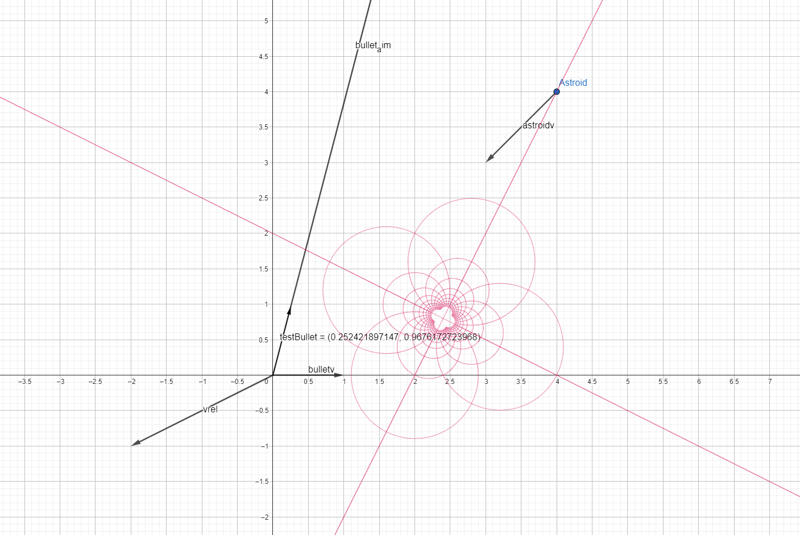

# Welcome to the Document about HomeFudge

[Arthur Erlich](https://github.com/ArthurErlich/PRIMA) [](https://wakatime.com/badge/github/ArthurErlich/PRIMA)

## Table of Contents

- [Welcome to the Document about HomeFudge](#welcome-to-the-document-about-homefudge)
  - [Table of Contents](#table-of-contents)
  - [Idea](#idea)
    - [The Destroyer:](#the-destroyer)
    - [Some Math:](#some-math)

## Idea

The basic idea of the Game Prototype is to have a Destroyer equipped with:

- One Gatling Turret for PD
- Two missile launchers
- Two beam weapons

The ideal case for the Game Prototype would be to have two Destroyers in a battle with each other using Fudge's Network ability for two players and an AI variant of the battle. The worst-case scenario is to have the Gatling Turret player-controlled to destroy incoming asteroids.

### The Destroyer:


### Some Math:

[Shooting a Moving Target (gamedeveloper.com)](https://www.gamedeveloper.com/programming/shooting-a-moving-target)
I found a got a solution for the problem of shooting a moving targe will be used for aiming the Gatling Turret.

```csharp
// Find the relative position and velocities
Vector3 relativePosition = target.position - gun.position;
Vector3 relativeVelocity = target.velocity - gun.velocity;

// Calculate the time a bullet will collide
// if it's possible to hit the target.
float deltaTime = AimAhead(relativePosition, relativeVelocity, bulletSpeed);

// If the time is negative, then we didn't get a solution.
if(deltaTime > 0f){
  // Aim at the point where the target will be at the time of the collision.
  Vector3 aimPoint = target.position + target.velocity*deltaTime;

  // fire at aimPoint!!!
}

// relativePosition: relative position
// relativeVelocity: relative velocity
// bulletSpeed: Speed of the bullet (muzzle velocity)
// returns: Delta time when the projectile will hit, or -1 if impossible
float AimAhead(Vector3 relativePosition, Vector3 relativeVelocity, float bulletSpeed){
  // Quadratic equation coefficients a*t^2 + b*t + c = 0
  float a = Vector3.Dot(relativeVelocity, relativeVelocity) - muzzleV*bulletSpeed;
  float b = 2f*Vector3.Dot(relativeVelocity, relativePosition);
  float c = Vector3.Dot(relativePosition, relativePosition);

  float desc = b*b - 4f*a*c;

  // If the discriminant is negative, then there is no solution
  if(det > 0f){
    return 2f*c/(Mathf.Sqrt(desc) - b);
  } else {
    return -1f;
  }
}
```

Before I found that solution, I started doing my own math, which I will keep here for reference:

doesn't it look beautiful? 