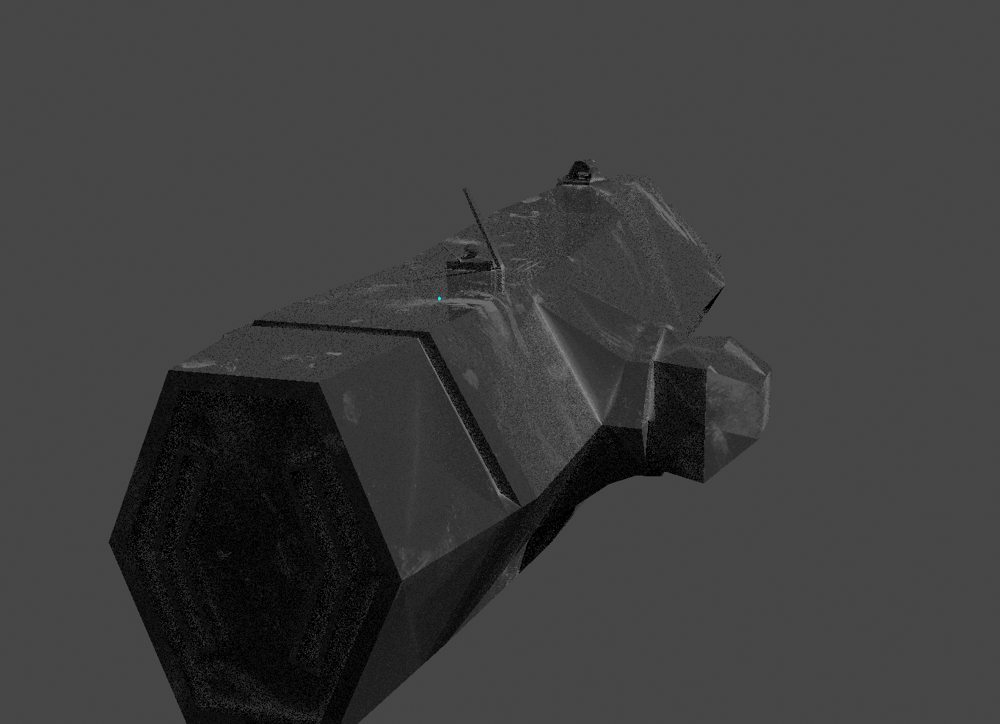
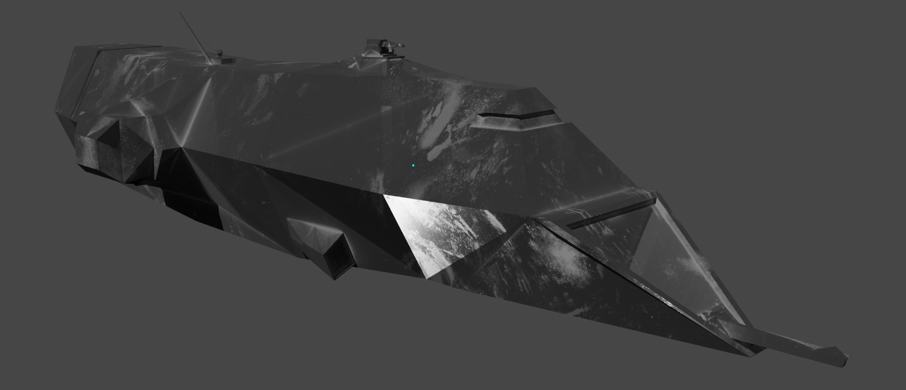

# Welcome to the Document about HomeFudge

[Arthur Erlich](https://github.com/ArthurErlich/PRIMA) 

## Table of Contents
- [Welcome to the Document about HomeFudge](#welcome-to-the-document-about-homefudge)
  - [Table of Contents](#table-of-contents)
  - [Idea](#idea)
    - [The Destroyer:](#the-destroyer)

## Idea

The basic idea of the Game Prototype is to have a Destroyer equipped with:

- One Gatling Turret for PD
- Two missile launchers
- Two beam weapons

The ideal case for the Game Prototype would be to have two Destroyers in a battle with each other using Fudge's Network ability for two players and an AI variant of the battle. The worst-case scenario is to have the Gatling Turret player-controlled to destroy incoming asteroids.

### The Destroyer:

